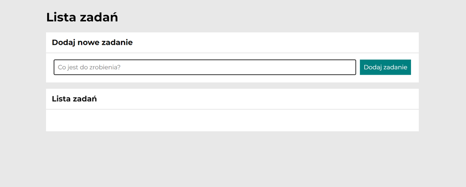

# My_to_do_list

## Demo

https://bartoszborzecki.github.io/My_to_do_list/

## Description

Here you can create your own list of tasks. You can add new tasks, mark off tasks which are done and delete it if you want. 

## Technologies used:

- HTML;
- CSS;
- JavaScript;
- BEM;
- MARKDOWN;

